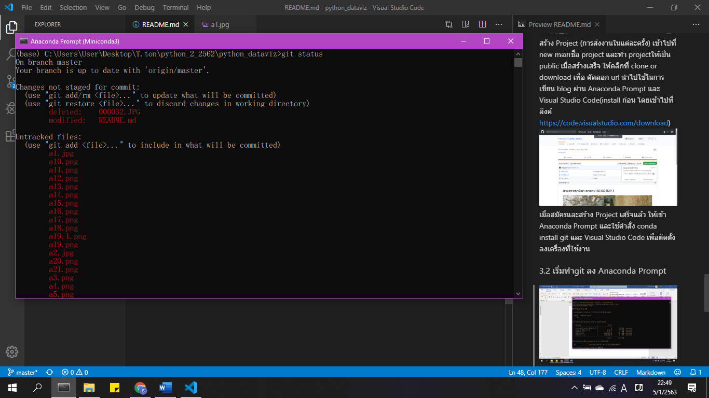

# นางสาวศุภนิตา   ดาดวน    603021129-1

## วิธีการinstall miniconda python + packgate
### 1.1 เข้าเว็บ https://docs.conda.io/en/latest/miniconda.html เลือกระบบปฎิบัติการและเวอร์ชันที่ต้องการติดตั้ง

ทำการติดตั้งจนสำเร็จการติดตั้ง จะได้ดังรูปข้างล่าง

เลือกเข้า Anacoda Prompt(Miniconda 3) 

จะเข้าสู่หน้าการพร้อมการใช้งาน

ตรวจสอบเวอร์ชัน pthon โดย การพิมพ์ python และกด enter 

หลังจากตรวจสอบเสร็จ ออกจาก python กลับมาที่ drive ใน อุปกรณ์ที่ใช้
### 1.2	การใช้ jupyter notebook เริ่มจาก

ติดตั้ง matplotlibและ jupyter เพื่อใช้ในการสร้าง visualization โดยใช้คำสั่ง conda install ตามด้วย package ที่ต้องการติดตั้ง

โปรแกรมจะถามว่าดำเนินการติดตั้งต่อหรือไม่ ให้พิมพ์ y แล้วกด enter

กรณีที่มีการติดตั้งแล้ว โปรแกรมจะขึ้นการแจ้งเตือนดังภาพข้างบน
ทำการเลือก folder ที่ต้องการให้ไฟล์เก็บอยู่ในตำแหน่งนั้น โดยการ พิมพ์ cd “ที่อยู่ folder” 

เมื่อย้ายเสร็จแล้ว ทำการเปิด jupyter notebook โดยการใช้คำสั่ง jupyter notebook เพื่อเริ่มเขียน code

ทำการสร้าง ไฟล์ ในการเขียน python 3 โดยการคลิกเข้าที่ new>>Python 3 จะได้ไฟล์การเขียน code Python 

เมื่อถึงหน้านี้ เป็นการเสร็จสิ้นในการติดตั้งและเริ่มใช้งาน python 3 ใน jupyter notebook

เมื่อต้องการจบการใช้งาน ให้กด ปิด ใน browser และกด ctrl+c ใน Anaconda Prompt 

โปรแกรมจะกลับมา ยัง drive ที่ระบุใน Anaconda Prompt
## วิธีการinstall  colab 
เข้าลิงค์ https://colab.research.google.com/notebooks/welcome.ipynb Log in google เพื่อการ save file python ที่เขียน ลง google drive 

สร้าง แผ่นงานในการเขียน python โดยเข้าไปที่ file>>new Python 3 notebook สามารถแก้ไขชื่องานที่ต้องการได้โดย double click ที่ ชื่อ fileแล้วพิมพ์แก้ 

กรณีต้องการเซฟสามารกด ctrl+ S ได้ ซึ่ง file จะถูก save ลง google drive ใน folder colab notebook โดยอัตโนมัติ 
## วิธีการใช้้งาน github
###  3.1 ลงทะเบียน ผ่านเว็บ https://github.com/

สร้าง Project (การส่งงานในแต่ละครั้ง) เข้าไปที่ new กรอกชื่อ project และทำ projectให้เป็น public เมื่อสร้างเสร็จ ให้คลิกที่ clone or download เพื่อ คัดลอก url นำไปใช้ในการเขียน blog ผ่าน Anaconda Prompt และ Visual Studio Code(install ก่อน โดยเข้าไปที่ลิงค์ https://code.visualstudio.com/download)

เมื่อสมัครและสร้าง Project เสร็จแล้ว ให้เข้า Anaconda Prompt และใช้คำสั่ง conda install git และ Visual Studio Code เพื่อติดตั้งลงเครื่องที่ใช้งาน
### 3.2 เริ่มทำgit ลง Anaconda Prompt

ติดตั้ง git โดยใช้คำสั่ง conda install -c anaconda git  จากั้นทำการเชื่อม git กับ anaconda โดยใช้คำสั่ง clone + URL ของ project ใน git hub ที่ต้องการจะลง จากนั้นใช้คำสั่ง code . เพื่อจะทำการแก้ไข project ใน Visual Studio Code 

เริ่มทำการเขียน Project
ใช้คำสั่ง git status เพื่ออัพเดทว่าเราได้เปลี่ยนแปลงอะไรไปบ้าง ถ้าขึ้นตัวอักษรสีแดงแสดงว่ายังไม่ทำการเปลี่ยนแปลงใน github ให้ใช้คำสั่ง git add เพิ่ม file ที่ต้องการ และใช้คำสั่ง git commit -m “test git” เพื่อดูคำอธิบาย file แล้วใช้คำสั่ง git push เพื่อให้สิ่งที่เราเปลี่ยนแปลง ลงใน github ดังรูปข้างล่างนี้

